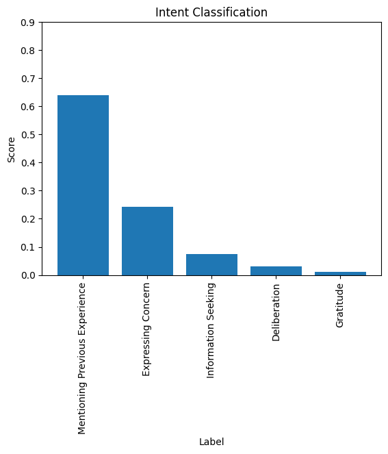

# chat-analysis

This is a github repository for classification of sentiment and intent of a customer response in a conversation between a customer and a representative.

## Example Outputs

Example Customer Response: "I've had some bad experiences with phone warranties before. What does AppleCare+ actually cover?"  

When we query the Sentiment Analysis Classifier we get the following probability distribution:
  

When we query the Intent Classifier we get the following probability distribution:
  

## Installation

First, clone the repository to your local machine.

It is recommended that you create a virtual environment to install and run this project

### Virtual Environment

To create a virtual environment simply type the following code.

```
conda create -n chatanalysis python=3.9
```

After creating the virtual environment you need to activate it.

```
conda activate chatanalysis
```

### Package Installation

To install the package simply type the following command in the project directory.

```
pip install -e .
```

## Usage

To use the tool simply type in the command line the following. This will run the program with default parameters that are given in config.yaml

```
chat-analysis
```

To view the input parameter options type the following.

```
chat-analysis --help
```

You can specify the chat log file path as a command line input argument as such.

```
chat-analysis --input-file=data/sample-data-2.json
```
